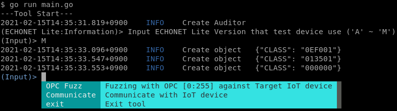

[](https://pkg.go.dev/github.com/tttfrfr2/ECHONETTester/)
# ECHONET Lite Test Tool
This is the test tool for ECHONET Lite vendor. 
This tool can test below

- OPC Fuzz
- Communicate with ECHONET Lite

## OPC Fuzz
OPC Fuzz send 255 ECHONET Lite pakcets to target device. Their OPCs are 0x01 to 0xFF. 

## Communicate 
Communicate communicate a target device with ECHONET Lite. There are 2 modes, Normal and Test mode. If Normal mode, you input number per a part of ECHONET Lite frame and can create ECHONET Lite frame based on the specification. If Test mode, you input any HEX number and create payload. After create payload, send the packet to target device and receive reply.

# Usage
You can launch this tool like below...
				go run main.go



There are command:
- OPC Fuzz
	Start to OPC Fuzz
- Communicate
	Start to communicate target device
- exit
	Exit tool

# LOG
Output log and result under log directory.

# Config
Config example...

```toml:config.toml
# This is a TOML document. Boom.

title = "Config"

[echonetLite]
ip = ["192.168.100.9"]
```
ip: IP addresses you wanna test target device has
